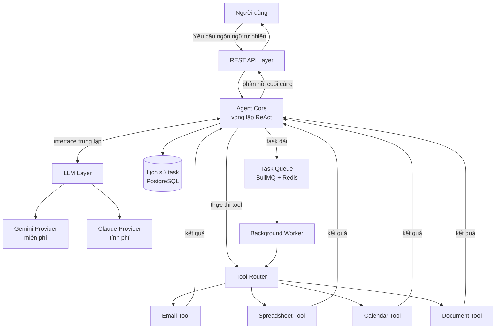
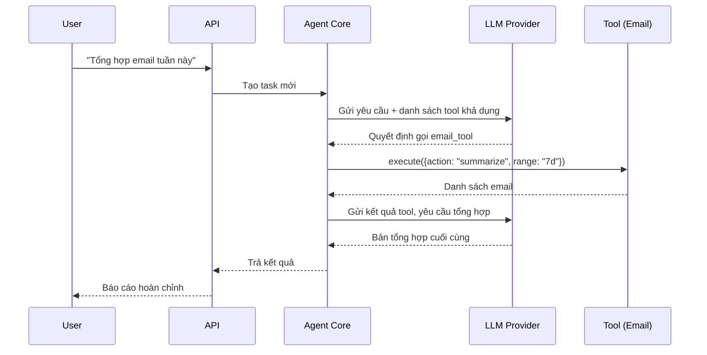

# 🤖 Office Agent

> AI Agent tự động hóa công việc văn phòng — nhận yêu cầu bằng ngôn ngữ tự nhiên, tự lên kế hoạch và thực thi thông qua hệ thống tool mở rộng được.

## 🎯 Mục tiêu dự án

Office Agent là một backend AI Agent có khả năng:
- Nhận yêu cầu bằng ngôn ngữ tự nhiên (vd: *"Tổng hợp email tuần này thành báo cáo"*)
- Tự phân tích và quyết định cần gọi công cụ nào để hoàn thành yêu cầu
- Thực thi qua các **tool** độc lập (email, spreadsheet, calendar, document...)
- Mở rộng sang lĩnh vực mới **không cần sửa phần lõi**

Dự án được xây dựng theo 2 nguyên tắc thiết kế xuyên suốt:
1. **Tool-based architecture** — mỗi năng lực là một module độc lập tuân theo interface chung
2. **Provider-agnostic LLM** — đổi nhà cung cấp AI (Gemini ↔ Claude) chỉ bằng 1 dòng cấu hình

## 📊 Trạng thái hiện tại

| Giai đoạn | Nội dung | Trạng thái |
|---|---|---|
| **1** | Agent loop (ReAct) + tool đầu tiên | ✅ Hoàn thành |
| **2** | Gmail API thật + lưu lịch sử task | 🔨 Đang làm |
| **3** | Task queue, scheduled tasks | 📋 Kế hoạch |
| **4** | Mở rộng sang social / game / testing | 📋 Kế hoạch |

## ✨ Tính năng

- [x] **Agent loop (ReAct)**: suy nghĩ → gọi tool → quan sát kết quả → lặp lại đến khi hoàn thành
- [x] **Tầng LLM provider-agnostic**: hỗ trợ Gemini (miễn phí) và Claude, đổi qua `.env`
- [x] Tool đọc/tóm tắt email *(hiện dùng dữ liệu giả lập)*
- [ ] Nối Gmail API thật qua OAuth 2.0
- [ ] Lưu lịch sử task (PostgreSQL)
- [ ] Tool đọc/ghi Google Sheets
- [ ] Tool tạo/sửa sự kiện lịch (Calendar API)
- [ ] Tool tạo báo cáo (Word/PDF)
- [ ] Task queue xử lý công việc chạy nền (BullMQ + Redis)
- [ ] Scheduled tasks (cron job tự động hóa định kỳ)

## 🏗️ Kiến trúc tổng quan



**Điểm mấu chốt:** Agent Core không biết đang dùng Gemini hay Claude, cũng không biết trước phải gọi tool nào. Nó chỉ làm việc qua interface — LLM tự quyết định tool dựa trên phần `description` của từng tool.

## 🔄 Luồng xử lý một task



Vòng lặp trên có thể lặp lại nhiều lần nếu task cần gọi nhiều tool liên tiếp — agent tự dừng khi LLM không yêu cầu gọi tool nữa.

## 🧩 Cấu trúc thư mục

```
office-agent/
├── src/
│   ├── core/
│   │   ├── agent.ts             # Vòng lặp ReAct - không phụ thuộc provider nào
│   │   ├── planner.ts           # (để dành cho kế hoạch nhiều bước phức tạp)
│   │   └── memory.ts            # (để dành cho lưu lịch sử task)
│   ├── llm/
│   │   ├── types.ts             # Kiểu dữ liệu trung lập (LLMMessage, LLMToolCall...)
│   │   ├── provider.ts          # Interface LLMProvider chung
│   │   ├── gemini.provider.ts   # Triển khai Gemini
│   │   ├── claude.provider.ts   # Triển khai Claude
│   │   └── index.ts             # Factory chọn provider theo .env
│   ├── tools/
│   │   ├── base.tool.ts         # Interface chung cho mọi tool
│   │   └── email.tool.ts        # Tool đầu tiên
│   ├── api/
│   │   └── task.route.ts        # POST /api/task
│   └── index.ts                 # Entrypoint
├── .env.example
├── package.json
└── tsconfig.json
```

## 🛠️ Công nghệ sử dụng

| Thành phần | Công nghệ |
|---|---|
| Ngôn ngữ | TypeScript / Node.js |
| API Framework | Express.js |
| LLM (mặc định) | **Google Gemini** — có gói miễn phí |
| LLM (tùy chọn) | Anthropic Claude |
| Database *(kế hoạch)* | PostgreSQL |
| Cache / Queue *(kế hoạch)* | Redis + BullMQ |

### Thiết kế tầng LLM: tại sao provider-agnostic?

`core/agent.ts` chỉ làm việc với các kiểu dữ liệu trung lập (`LLMMessage`, `LLMToolCall`), không import SDK của bất kỳ nhà cung cấp nào. Mỗi provider tự lo việc chuyển đổi qua lại giữa định dạng riêng của mình và định dạng trung lập.

Lợi ích thực tế đã kiểm chứng:
- Đổi từ Claude (tính phí) sang Gemini (miễn phí) **không cần sửa một dòng nào** trong `agent.ts`, `tools/`, hay `api/`
- Đổi model AI chỉ cần sửa `.env`, không cần build lại
- Thêm provider mới (Groq, Ollama...) = thêm 1 file implement `LLMProvider`

Trường hợp đặc biệt đã xử lý: các model Gemini 3+ trả về `thoughtSignature` kèm mỗi lần gọi tool và **bắt buộc** phải gửi lại nguyên vẹn ở lượt sau. Vì đây là dữ liệu riêng của provider, nó được mang theo trong trường `providerMeta` — agent không cần hiểu nội dung, chỉ cần chuyển tiếp.

## 🌐 Tầm nhìn dài hạn: 4 lĩnh vực ứng dụng

Nhờ kiến trúc tool-based, việc thêm tool cho lĩnh vực mới không cần sửa phần lõi — chỉ cần tạo tool mới tuân theo interface chung và đăng ký vào Tool Router.

| Lĩnh vực | Ví dụ tool | Trạng thái |
|---|---|---|
| 🏢 **Tự động hóa văn phòng** | Email, Spreadsheet, Calendar, Document | 🔨 Đang phát triển |
| 📱 **Mạng xã hội** | Đăng bài, trả lời comment, phân tích tương tác | 📋 Kế hoạch |
| 🎮 **Game** | Điều khiển nhân vật, chơi game turn-based/real-time | 📋 Kế hoạch |
| 🧪 **Kiểm thử phần mềm** | Chạy test tự động, đọc report, phát hiện lỗi | 📋 Kế hoạch |

### Cách tiếp cận kỹ thuật cho từng lĩnh vực

**Mạng xã hội** — gọi trực tiếp API nền tảng để đăng bài, đọc/trả lời bình luận.

**Game** — tùy loại game, chọn hướng phù hợp:

| Cách tiếp cận | Phù hợp với | Độ khó |
|---|---|---|
| Gọi API/SDK của game (turn-based) | Cờ vua, caro, game bài | Dễ |
| Headless browser control (Playwright) | Game chạy trên web | Trung bình |
| Screen capture + Computer Vision | Game không có API | Khó |

**Kiểm thử phần mềm** — tool gọi test runner (Jest, Playwright...), đọc log/report, phân tích lỗi.

### Chiến lược đa ngôn ngữ (polyglot) — chỉ khi cần thiết

Kiến trúc cho phép mỗi module dùng ngôn ngữ khác nhau (giao tiếp qua REST API / message queue). Tuy nhiên dự án chỉ tách ngôn ngữ khi có **lý do kỹ thuật rõ ràng**:

| Module | Ngôn ngữ | Khi nào cần |
|---|---|---|
| Core + tool gọi API | Node.js/TypeScript | Luôn dùng — nền tảng chính |
| Tool Computer Vision | Python | Khi cần OpenCV/PyTorch |
| Tool kiểm thử song song | Go | Khi cần concurrency mạnh |

## ⚙️ Cài đặt & chạy thử

**1. Clone và cài dependencies**
```bash
git clone https://github.com/duylong06/tool-auto-v-p-pro.git
cd tool-auto-v-p-pro
npm install
```

**2. Lấy API key Gemini (miễn phí, không cần thẻ tín dụng)**

Truy cập [Google AI Studio](https://aistudio.google.com/apikey) → đăng nhập → **Create API key**.

**3. Tạo file `.env`**
```bash
cp .env.example .env
```

Nội dung `.env`:
```env
LLM_PROVIDER=gemini
GEMINI_API_KEY=your_key_here
GEMINI_MODEL=gemini-3.6-flash
PORT=3000
```

**4. Chạy server**
```bash
npm run dev
```

**5. Gửi thử một task**
```bash
curl -X POST http://localhost:3000/api/task \
  -H "Content-Type: application/json" \
  -d '{"message": "Tong hop email 7 ngay qua giup toi"}'
```

Kết quả mẫu:
```json
{
  "finalAnswer": "Dưới đây là tổng hợp email của bạn trong 7 ngày qua...",
  "toolsUsed": ["email_tool"],
  "turns": 2
}
```

> `turns: 2` cho thấy agent chạy 2 vòng: một vòng gọi tool, một vòng tổng hợp kết quả.

## 🔌 Thêm một tool mới

Chỉ cần 3 bước, không sửa phần lõi:

**1.** Tạo file trong `src/tools/`, implement interface `Tool`:
```ts
export const myTool: Tool = {
  name: 'my_tool',
  description: 'Mô tả rõ tool làm gì — LLM dựa vào đây để quyết định có gọi hay không',
  inputSchema: { /* JSON Schema */ },
  async execute(params) { /* ... */ },
};
```

**2.** Đăng ký vào danh sách tool trong `src/api/task.route.ts`

**3.** Xong — LLM tự biết cách dùng tool mới dựa trên `description`

## 📄 License

MIT
